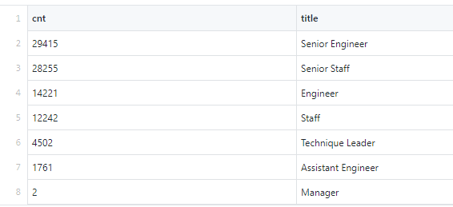
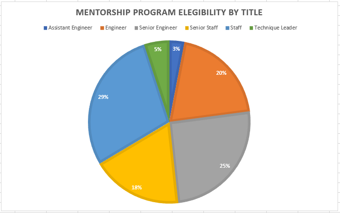

# Overview
Pewlett-Hackard is in a situation comparable to many other U.S. companies; they face the imminent retirement of many baby boomer employees, who constitute a disproportionately large share of employees due to that generation’s size. To proactively head off this issue, the firm has asked me to conduct an analysis of their employment records to determine how many retirees they can expect in the near future by job title, as well as which employees are eligible for a mentorship program.

## Tools
Software: SQLite, PGAdmin 4, PostgreSQL

[Data:](https://github.com/perryabdulkadir/Pewlett-Hackard-Analysis/tree/main/Data/Raw_data) departments.csv, dept_emp.csv, dept_manager.csv, employees.csv, salaries.csv, titles.csv

## Analysis 

To begin, I created three tables for later use. 

```
CREATE TABLE employees (
	emp_no INT NOT NULL,
     birth_date DATE NOT NULL,
     first_name VARCHAR NOT NULL,
     last_name VARCHAR NOT NULL,
     gender VARCHAR NOT NULL,
     hire_date DATE NOT NULL,
     PRIMARY KEY (emp_no)
);

SELECT * FROM employees;

CREATE TABLE titles (
	 emp_no INT NOT NULL,
	 title VARCHAR NOT NULL,
     from_date DATE NOT NULL,
	 to_date DATE NOT NULL,
	 FOREIGN KEY (emp_no) REFERENCES employees (emp_no)
);

SELECT * FROM titles;

CREATE TABLE dept_emp (
	 emp_no INT NOT NULL,
	 dept_no  VARCHAR(4) NOT NULL,
     from_date DATE NOT NULL,
	 to_date DATE NOT NULL,
	 FOREIGN KEY (emp_no) REFERENCES employees (emp_no)
);

SELECT * FROM dept_emp;
```


### Number of Employees Retiring by Job Title

To begin the analysis of expected retirements, I retrieved the employee numbers, first names, and last names for employees born between 1952-1955 from the employees table. This selection was turned into a new table called retirement info using the INTO clause. 

```
SELECT emp_no, first_name, last_name
INTO retirement_info
FROM employees
WHERE (birth_date BETWEEN '1952-01-01' AND '1955-12-31')
ORDER BY emp_no;

SELECT * FROM dept_emp;
```

Next, I queried the newly created retirement_info table to pull job titles, employment start dates, and employment end dates. Using the INTO method again, the queried data was turned into a new table, retirement_titles. I joined retirement_titles and retirement_info on the primary key. 

```
SELECT retirement_info.emp_no, retirement_info.first_name, retirement_info.last_name, 
titles.title, titles.from_date, titles.to_date
INTO retirement_titles
FROM titles
INNER JOIN retirement_info
ON titles.emp_no = retirement_info.emp_no
ORDER BY titles.emp_no;

SELECT * FROM retirement_titles;
```

I retrieved the employee numbers, first and last names, and titles from retirement_titles. Using DISTINCT ON to retrieve the first occurrence of an employee number, I again used the INTO clause to create a new table, unique_titles.

```
SELECT DISTINCT ON (emp_no) emp_no, first_name, last_name, title
INTO unique_titles
FROM retirement_titles
ORDER BY emp_no, from_date DESC;

SELECT * FROM unique_titles;
```

The last step of this analysis was retrieving the number of employees about to retire by job title. I retrieved the number of each title using SELECT COUNT(title), then used INTO to create the retiring_titles table. Finally, I grouped the table by title and sorted in descending order by number of titles. Lastly, I ordered the table by employee number.

```
SELECT COUNT(title) as cnt, title 
INTO retiring_titles
FROM unique_titles
GROUP BY title
ORDER BY cnt DESC;
```
The retirement_titles, unique_titles, and retiring_titles were all exported as [their respective .CSVs.](https://github.com/perryabdulkadir/Pewlett-Hackard-Analysis/tree/main/Data)

### Mentorship program eligibility 

I used an SQL query to retrieve a list of employees who would soon be eligible to participate in the mentorship program (those born in 1965). First, I retrieved the employee number, first name, last name, and birth date columns from the employees table. I retrieved these using the DISTINCT ON clause so as to only retrieve the first instance of each employee number. Then, from the dept_emp table, I retrieved the from date and to date columns. Next, I retrieved titles from the titles table. An INTO clause was used to put this retrieved information into a single, new table called mentorship_eligibility. I then joined the employees and dept_emp tables using INNER JOIN. Subsequently, I joined employees and titles using the primary key. I filtered for all employees born in 1965 after setting to_date to the year 9999-01-01 to search all current employees. 

```
SELECT DISTINCT ON (employees.emp_no) employees.emp_no, employees.first_name, employees.last_name, employees.birth_date,
dept_emp.from_date, dept_emp.to_date,
titles.title
INTO mentorship_eligibilty
FROM employees
INNER JOIN dept_emp ON dept_emp.emp_no = employees.emp_no
INNER JOIN titles ON titles.emp_no = employees.emp_no
WHERE dept_emp.to_date = '9999-01-01'
AND (employees.birth_date BETWEEN '1965-01-01' AND '1965-12-31')
ORDER BY employees.emp_no;

SELECT * FROM mentorship_eligibilty;
```
Lastly, I exported the table as [mentorship_eligibilty.csv.](https://github.com/perryabdulkadir/Pewlett-Hackard-Analysis/blob/main/Data/mentorship_eligibilty.csv)


## Results
### Retiring by job title



* The above table makes clear that in the near future, large numbers (10,000+) of senior engineers, senior staff, engineers, and staff will be needed. 
* The table also demonstrates that the need for additional managers will be negligible. 

### Mentorship program eligibility 




* A small number of employees are eligible for the Mentorship Program (1,549) compared to the number expected to retire (90,398).
* As shown in the pie chart above, significant proportions of those eligible for the mentorship program are staff, senior staff, engineers, and senior engineers. Few are technique leaders or assistant engineers.

## Summary
90,398 employees are likely to retire soon in the silver tsunami. With over 90,000 positions soon to be empty, and only 1,549 employees eligible for the mentorship program, each mentor would need to take on 58 new employees. At that point, it would not be a mentor relationship but an auditorium lecture. So, Pewlett-Hackard must either broaden the eligibility for mentor participation or find another solution to getting the new hires acclimated. 

If we conduct further analysis, it would be beneficial to see if more specific job title information exists. For example, over 40,000 employees simply have the title of “staff” or “senior staff”. If we could find department-level data on employees’ more specific titles, we could give the business a better idea of its staffing needs going forward. 

There are [estimates](https://partners.pennfoster.edu/blog/2015/september/the-cost-of-hiring-the-perfect-candidate-vs,-d-,-training-an-existing-employee) that employee turnover can cost 50%-60% of an employee’s annual salary due to lost productivity and training costs. By using the salaries.csv table, we could calculate the total wages of the employees expected to retire. This would give the business a rough estimate of the costs to expect associated with the turnover. 


### **Contact:**

**Email:** perry.abdulkadir@alumni.harvard.edu

**Linkedin:** https://www.linkedin.com/in/perry-abdulkadir-6a255199/

